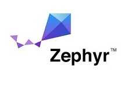

# BL5340 Application Core Common

This is the Common Application Core firmware for the BL5340 module, intended for use with the [DTM firmware] and [Radio Test firmware] applications. It is developed in C using the nRF Connect SDK. The Network Core application must also be programmed to the target module before usage.

# Content

The Application Core DTM application is based upon the empty_app_core and entropy_nrf53 samples supplied with the nRF Connect SDK v1.5.1.

It implements an IPC server used by the Network Core to perform Remote Procedure Calls to configure registers only accessible by the Application Core.

# Programming the application

The Application Core application is programmed via NRFJProg using the following command.

    nrfjprog -f NRF53 --program dtm_application.hex --sectorerase

# Using the application

Upon starting the Application Core part, control is assumed by the Network Core based application. Refer to that readme file for further details.

[DTM firmware]: ../dtm/readme.md "BL5340 DTM"
[Radio Test firmware]: ../radio_test/readme.md "BL5340 Radio Test"
