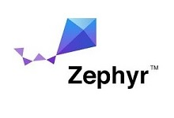

# BL5340 Application Core DTM/Module firmware

This is the Application Core DTM firmware for the BL5340 module. It is developed in C using the nRF Connect SDK. The Network Core application must also be programmed to the target module before usage.

Full details of all DTM client commands are described in the [DTM Network Core Common] readme file.

# Content

This application is based upon the empty_app_core and entropy_nrf53 samples supplied with the nRF Connect SDK v1.5.1.

It implements an IPC server used by the Network Core to perform Remote Procedure Calls to configure registers only accessible by the Application Core. If built in the default module variant, it also includes driver code that allows manipulation and readback of the module GPIOs by the DTM client, if built in the development board variant, it also includes driver code for each of the on-board DVK peripherals and provides status information for the peripherals for the DTM client.

# Building the application

This application can be built for the BL5340 module or BL5340 development kit, the module build only exercises GPIOs whilst the development board build exercises the various interfaces and hardware on the development kit board.

To configure for a BL5340 module build:

    mkdir build
    cd build
    cmake -GNinja -DBOARD=bl5340_dvk_cpuapp ..

To configure for a BL5340 development board build:

    mkdir build
    cd build
    cmake -GNinja -DBOARD=bl5340_dvk_cpuapp -DOVERLAY_CONFIG=bl5340_dvk.overlay ..

To build the application:

    ninja

To flash the image to an attached board:

    ninja flash

# Programming the application

The Application Core application is programmed via nrfjprog using the following command.

    nrfjprog -f NRF53 --program dtm_module_application.hex --sectorerase

# Using the application

Upon starting the Application Core part, control is assumed by the Network Core based application. Refer to the [DTM Network Core Common] readme file for further details.

[DTM Network Core Common]: ../../common/dtm_network_core_common/README.md "BL5340 DTM Network Core Common"
