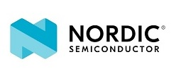
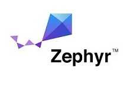

# BL5340 DTM/DVK firmware

This is the DTM/DVK firmware for the BL5340 module. It is provided as separate applications for the Application and Network cores which must both be programmed to the target DVK before usage.

# Content

Refer to the [DTM/DVK Application] and [DTM/DVK Network] readme files for further details.

[DTM/DVK Application]: dtm_dvk_application/readme.md "BL5340 DTM/DVK Application"
[DTM/DVK Network]: dtm_dvk_network/readme.md "BL5340 DTM/DVK Network"
