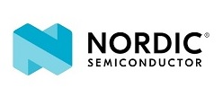

# BL5340 Application Core DTM/Module firmware

This is the Application Core DTM/Module firmware for the BL5340 module. It is developed in C using the nRF Connect SDK. The Network Core application must also be programmed to the target module before usage.

Full details of all DTM client commands are described in the [DTM Network Core Common] readme file.

# Content

This application is based upon the empty_app_core and entropy_nrf53 samples supplied with the nRF Connect SDK v1.5.1.

It implements an IPC server used by the Network Core to perform Remote Procedure Calls to configure registers only accessible by the Application Core. It also includes driver code that allows manipulation and readback of the module GPIOs by the DTM client.

# Programming the application

The Application Core application is programmed via NRFJProg using the following command.

    nrfjprog -f NRF53 --program dtm_module_application.hex --sectorerase

# Using the application

Upon starting the Application Core part, control is assumed by the Network Core based application. Refer to the [DTM Network Core Common] readme file for further details.

[DTM Network Core Common]: ../../../dtm_network_core_common/README.md "BL5340 DTM Network Core Common"
