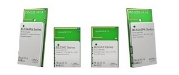

# BL5340 Network Core DTM/Module firmware

This is the Network Core DTM/Module firmware for the BL5340 module. It is developed in C using the nRF Connect SDK. The Application Core part must also be programmed to the target module before usage. This is predominantly to allow the underlying Zephyr RTOS to start the Network Core, but also for management of registers that cannot be accessed via the Network Core (e.g. Regulator and Oscillator control). Drivers are also included for manipulation of the module GPIOs, with the status of each controllable and readable by the DTM client. Refer to the [DTM Network Core Common] readme for further details.

# Content

The Network Core DTM application is based upon the direct_test_mode and entropy_nrf53 samples supplied with the nRF Connect SDK v1.5.1. It is fully compatible with the DTM Application included with the nRF Connect Tool Suite. Vendor specific commands are used to control and configure the module regulators and oscillators such that only support for the DTM protocol is needed.

Because the regulator and oscillator registers must be controlled by the application core, IPC is used by the Network Core to perform Remote Procedure Calls to the Application Core to achieve this. When not performing Remote Procedure Calls, the Application Core is idle.

# Programming the application

The Network Core application is programmed via NRFJProg using the following command.

    nrfjprog -f NRF53 --coprocessor CP_NETWORK --program dtm_module_network.hex --sectorerase

Note that the --coprocessor CP_NETWORK argument must be used to indicate to the programmer the appropriate core to be programmed. If this is omitted, the Application Core is programmed by default.

[DTM Network Core Common]: ../../../dtm_network_core_common/README.md "BL5340 DTM Network Core Common"
