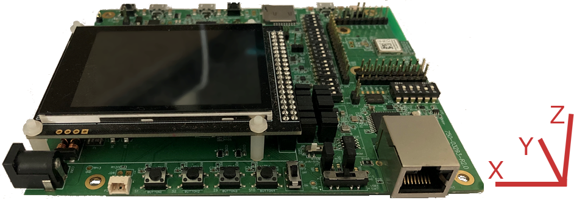

# Accelerometer Edge Impulse Training Sample Application

## Overview

This sample application is used for the Edge Impulse neural network
BL5340 guide and enables reading of the accelerometer data out of the
UART which can then be ingested by Edge Impulse to be used as training
or test data sets to train or test a neural network.

## Requirements

* BL5340 development kit with DIP switches for accelerometer enabled

## Usage

This sample code reads the Z axis data from the LIS3DH sensor and
outputs it over the UART. Data sampling is performed at a specific
frequency so that it is reproducible, and all data sets are operating
at the same rate. To configure the project, run the following:

Build the project using:

```
west build -p -b bl5340_dvk_cpuapp
```

To flash the compiled code to a development kit use the command:

```
west flash
```

Follow the Edge Impulse guide in the documentation section on the
[BL5340 product page](https://www.lairdconnect.com/wireless-modules/bluetooth-modules/bluetooth-5-modules/bl5340-series-multi-core-bluetooth-52-802154-nfc-modules)
to use this sample application. Note that the
orientation of the axis is displayed on the BL5340 development board
where the LID3DH sensor is in silkscreen.


